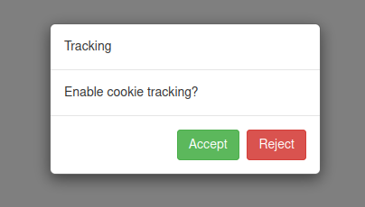

<!-- badges: start -->
<!-- badges: end -->

# shinymetrics

R package to track shiny applications with [shinymetrics](https://shinymetrics.com).

<a class="mb-4 mr-4 btn btn-info" href="articles/get-started.html">Get Started</a>
<a target="_blank" class="mb-4 btn btn-default" href="https://shinymetrics.com">Main site</a>

## Installation

You can install the development version of shinymetrics from [GitHub](https://github.com/) with:

``` r
# install.packages("remotes")
remotes::install_github("devOpifex/shinymetrics")
```

## How it works

Place your token for your registered application in your `.Renviron`
(or elsewhere as environment variable) as `SHINYMETRICS_TOKEN`.

1. Create a tracker with the `Shinymetrics` class
2. Include the tracker in the UI
3. (Optional but recommended) include the server-side function `shinymetrics_server()` for useful information

```r
library(shiny)
library(shinymetrics)

# initialise the tracker
tracker <- Shinymetrics$new()$track_recommended()

ui <- fluidPage(
  tracker$include(), # include in the UI
  trackingModalBS3() # consent prompt
)

server <- function(input, output, session) {
  shinymetrics_server() # (optional) print information on tracking
}

shinyApp(ui, server)
```



## Prompts

The package comes with prompts to help developers collect consent from
users to enable or disable tracking.
These prompts toggle tracking and cookies on and off but DO NOT store consent,
if that is required you must implemented it yourself.

