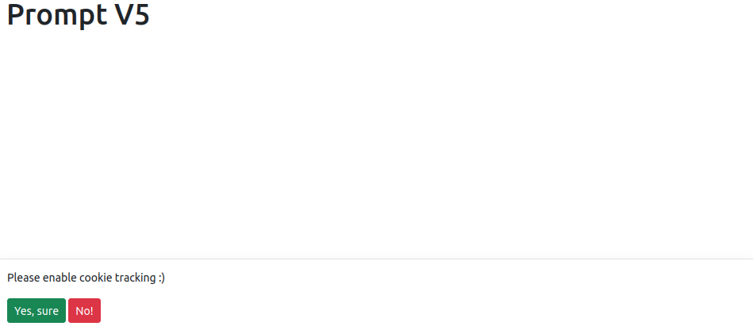
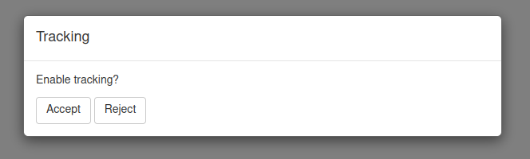
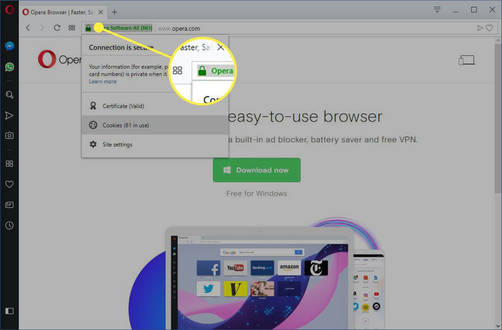

```{r, include = FALSE}
knitr::opts_chunk$set(
  collapse = TRUE,
  comment = "#>"
)
```

```{r setup, echo = FALSE}
library(shinymetrics)
```

<div class="alert alert-warning" role="alert">
These prompts toggle tracking and cookies on and off but DO NOT store consent,
if that is required you must implemented it yourself.
</div>

# Collect Consent

There are two ways to collect user consent to initialise tracking:

1. Use one of provided UI functions to prompt the user for consent
2. Build something custom

## Pre-built Prompts

:+1: It is recommended to use the pre-built prompts.

Pre-built prompts to place in your UI, use depends on
style preference and Bootstrap version, all their arguments
are optional.

- `trackingToastBS5()` - Bootstrap 5 notification
- `trackingModalBS5()` - Bootstrap 5 modal
- `trackingModalBS4()` - Bootstrap 4 modal
- `trackingModalBS3()` - Bootstrap 3 modal

```r
library(shiny)
library(shinymetrics)

tracker <- Shinymetrics$new()$track_recommended()

ui <- fluidPage(
  theme = bslib::bs_theme(version = 5L),
  tracker$include(),
  trackingToastBS5(
    full_width = TRUE,
    background = "white",
    position = "bottom",
    prompt = "Please enable cookie tracking :)",
    accept = "Yes, sure",
    reject = "No!"
  ),
  div(
    style = "min-height:100vh;",
    h1("Prompt V5")
  )
)
 
server <- function(input, output, session) {
  shinymetrics_server()
}

shinyApp(ui, server)
```



## Custom Prompt

Alternatively you can of course create a custom prompt of your choosing.

```r
library(shiny)
library(shinymetrics)

tracker <- Shinymetrics$new()$track_recommended()

ui <- fluidPage(
  tracker$include()
)

server <- function(input, output, session) {
  shinymetrics_server()

  observe({
    # shinymetrics tracking is already enabled
    # no need to show the modal
    if(is.null(input$shinymetricsEnabled))
      return()

    if(input$shinymetricsEnabled)
      return()

    showModal(
      modalDialog(
        title = "Tracking",
        p("Enable tracking?"),
        actionButton("accept", "Accept"),
        actionButton("reject", "Reject"),
        easyClose = FALSE,
        footer = NULL
      ) 
    )
  })

  observeEvent(input$accept, {
    removeModal()
    shinymetrics_enable()
  })

  observeEvent(input$reject, {
    removeModal()
    shinymetrics_disable()
  })
}

shinyApp(ui, server)
```



## Cookies and testing

When shinymetrics is enabled it stores some information as cookie
so the user does not have to enable tracking at every visit.

This means that once you have enabled tracking you have cookie stored
in your browser and the consent prompt will no longer show.
This may not be convenient while testing or building a cutom prompt. 
There are two ways to tackle this issue:

1. Visit your application in "incognito" mode so it does not store cookies.
  See instructions for [Chrome](https://support.google.com/chrome/answer/95464?hl=en&co=GENIE.Platform%3DDesktop),
  [Firefox](https://support.mozilla.org/en-US/kb/private-browsing-use-firefox-without-history),
  [Safari](https://support.apple.com/en-us/HT203036), and
  [Edge](https://support.microsoft.com/en-us/microsoft-edge/browse-inprivate-in-microsoft-edge-e6f47704-340c-7d4f-b00d-d0cf35aa1fcc)
2. From your browser clear the cookies for your app.
  Visit your application in your browser then, generally, click on the icons left of the left
  of the URL and clear the cookies.



