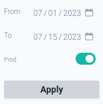

```{r, include = FALSE}
knitr::opts_chunk$set(
  collapse = TRUE,
  comment = "#>"
)
```

[Shinymetrics](https://shinymetrics.com) allows distinguishing between "prod" and
"dev" environments.
These events can be toggled on your dashboards so you don't confuse real
activity made by genuine users and events fired by programmers
as they develop the application.



Whilst developing set the `prod` argument of the constructor to `FALSE`.

```r
tracker <- Shinymetrics$new(prod = FALSE)$track_recommended()
```

> Make this is set to `TRUE` when you deploy.

If you are building a {golem} application: use the `golem.app.prod` option.

```r
tracker <- Shinymetrics$new(prod = getOption("golem.app.prod"))$track_recommended()
```
