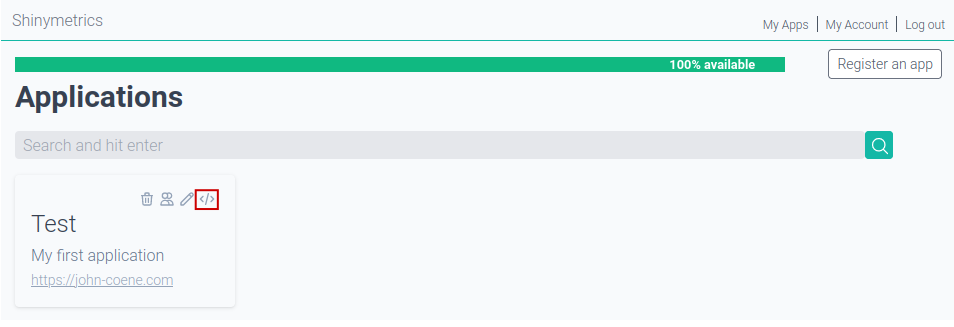

```{r, include = FALSE}
knitr::opts_chunk$set(
  collapse = TRUE,
  comment = "#>"
)
```

# 1. Create an Account

Create a free account on [shinymetrics](https://shinymetrics.com),
this will not require you to enter any credit card information.


After creating your account please check your inbox for an email coming
from `hello@shinymetrics.com` for an activation link.

# 2. Register an App

After your account has been created and activated you are able to login and 
register your first application. 

Login and visit "My Apps" (top right) then click the "Register an app" button
and fill in the form adequately.


# 3. Get your tracking code

Once the app registered it will appear on your main dashboard.
Click the <i class='fa fa-code'></i> icon to obtain your tracking code.



# 4. Track your app

Follow the instructions on this page to implement tracking in your application.

<div class="alert alert-danger" role="alert">
You are responsible for obtaining consent from users before tracking.
By default, the shinymetrics R package DOES NOT track anything.
See the 
<a href="consent.html">documentation on consent</a>
for more information.
</div>


